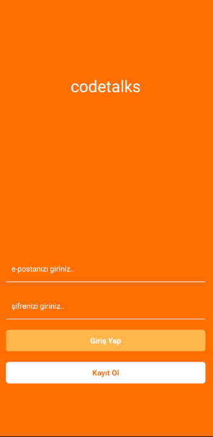
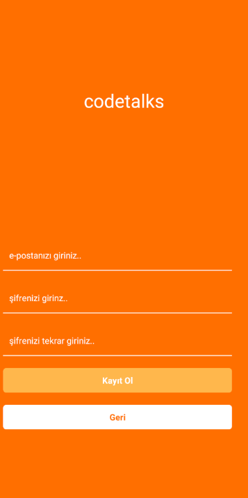
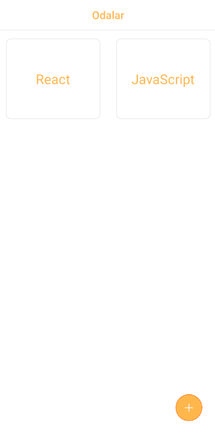
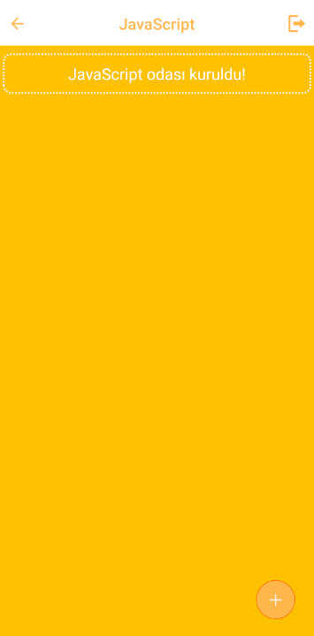
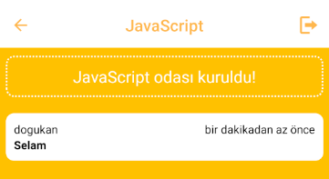

# CodeTalks

**CodeTalks**, kullanıcı girişi, yeni kullanıcı oluşturma ve odalar oluşturma özellikleri sunan bir mesajlaşma uygulamasıdır. Kullanıcılar, arkadaşlarıyla bire bir sohbetlerin yanı sıra, özel odalarda ayrı ayrı sohbet edebilirler.

## Özellikler

- **Kullanıcı Girişi**:
  - Mevcut kullanıcılar, hesaplarına giriş yaparak uygulamanın mesajlaşma özelliklerine erişebilirler.
  - Giriş yaparken e-posta adresi ve şifre kullanılır.
  - 

- **Yeni Kullanıcı Oluşturma**:
  - Yeni kullanıcılar, uygulamaya kayıt olarak yeni bir hesap oluşturabilirler.
  - Kayıt işlemi için e-posta adresi, kullanıcı adı ve şifre gereklidir.
  - - 

- **Oda Oluşturma**:
  - Kullanıcılar, yeni sohbet odaları oluşturabilirler.
  - Her oda, kullanıcıların ayrı ayrı sohbet edebileceği bir alan sağlar.
  - 

- **Odalarda Sohbet**:
  - Oluşturulan odalarda kullanıcılar mesajlaşabilirler.
  - Her oda, bağımsız bir sohbet geçmişi ile kullanıcıların etkileşimde bulunmasını sağlar.
  - 
  - 

## Kurulum

1. Projeyi klonlayın:
   ```
   git clone https://github.com/Dogukan-Hellac/codeTalks.git
   ```
2.  Proje Dizinine Gidin:
  ```bash
  cd codetalks
  ```
3. Gerekli Bağımlılıkları Yükleyin:
  ```bash
  npm install
  npm install -g expo-cli
  ```
4. Uygulamayı Çalıştırın:
  ```bash
  npx expo start
  ```
